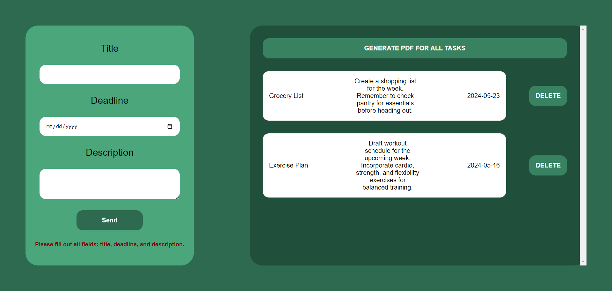

## Project Features

- Task Management: Users can easily add and delete tasks from the system.
- PDF Generation: The application allows users to generate a PDF report containing all tasks for easy reference.

 ## Technical Details

- Dependency Management: Composer is used to manage PHP dependencies efficiently.
- Routing: The project utilizes custom routing for seamless navigation between different views and functionalities.
- MVC Architecture: Following the MVC architectural pattern ensures a clear separation of concerns and maintainability.
- Database Interaction: PDO (PHP Data Objects) is employed for secure and efficient interaction with the underlying database.
- JavaScript Integration

# Screenshots

## Installation Instructions

1. Clone the repository to your local machine.
2. Install dependencies using Composer: composer install.
3. Configure database settings in the config.php file.
4. Import the SQL schema located in the database directory to set up the database.
5. Start the PHP server and navigate to the project directory.
6. Access the application through your web browser.
